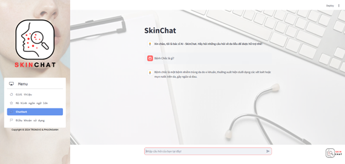
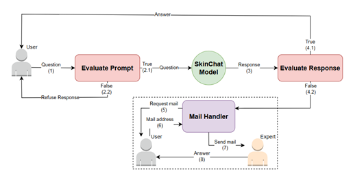
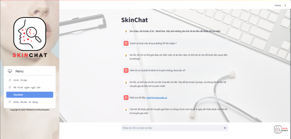
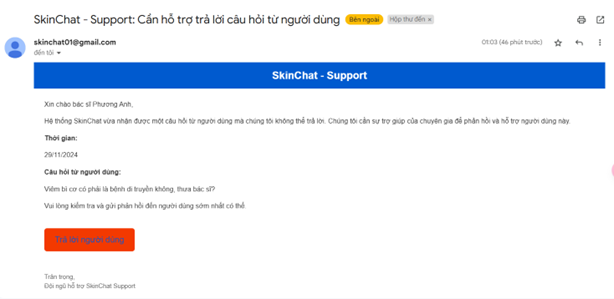

# SkinChat - T5

[](https://www.python.org/downloads/release/python-3100/)
[](https://pytorch.org/)
[](https://pypi.org/project/simplet5/)
[](https://pypi.org/project/transformers/)
[](https://ai.google.dev/)
[](https://docs.streamlit.io/)
[](https://www.apache.org/licenses/LICENSE-2.0)

Đây là project phục vụ cho báo cáo tiểu luận chuyên ngành với đề tài tìm hiểu mô hình ngôn ngữ lớn và ứng dụng xây dựng Chatbot.

Với mục tiêu xây dựng một **chatbot** tư vấn trả lời câu hỏi về **da liễu** dựa trên mô hình ngôn ngữ lớn, chúng ta sẽ tiến hành một số bước như sau:

| Giai đoạn | Thao tác |
|-----------|----------|
| Giai đoạn 1 | Chuẩn bị dữ liệu |
| Giai đoạn 2 | Huấn luyện tokenizer và mô hình |
| Giai đoạn 3 | Đánh giá và kiểm tra chất lượng mô hình |
| Giai đoạn 4 | Tích hợp và xây dựng ứng dụng Chatbot |
| Giai đoạn 5 | Thực nghiệm và cải thiện ứng dụng |

## 📄 Giai đoạn 1: Chuẩn bị dữ liệu

### Web Crawling

Các nguồn dữ liệu được chúng tôi thu thập từ các trang web uy tín bao gồm: 

- [Bệnh viện 115](https://benhvien115.com.vn/)
- [Bệnh viện Nhi Trung Ương](http://benhviennhi.org.vn/)
- [eDoctor](https://edoctor.io/)
- [Chuyên mục Da liễu - VnExpress](https://vnexpress.net/suc-khoe/cac-benh/da-lieu)
- [Ivie](https://ivie.vn/)
- [VietSkin](https://www.vietskin.vn/)

| **Nguồn**              | **Số mẫu** | **Ngày truy cập** | **Thời gian**  | **Phương pháp**      |
|-------------------------|------------|-------------------|----------------|-----------------------|
| eDoctor                | 335        | 18/10/2024        | 3 giờ          | Mã nguồn Python      |
| Ivie                   | 611        | 19/10/2024        | 6 giờ          | Mã nguồn Python      |
| VNEXPRESS              | 32         | 20/10/2024        | 10 phút        | Mã nguồn Python      |
| Bệnh viện 115          | 23         | 20/10/2024        | 20 phút        | Thủ công             |
| VietSkin               | 6          | 21/10/2024        | 5 phút         | Thủ công             |
| Bệnh viện Nhi Đồng 2   | 50         | 21/10/2024        | 1 giờ          | Mã nguồn Python      |

**Tổng cộng**: **1057 mẫu**, **10 giờ 35 phút thu thập**.

### Synthetic Data Generation & Data Augmentation

Tất cả các dữ liệu đó sẽ được sinh dữ liệu tổng hợp và tăng cường dữ liệu thông qua một mô hình ngôn ngữ đóng vai trò làm **"thầy giáo"**. Ở đây, chúng tôi lựa chọn nhóm mô hình **Gemini** của **Google AI** vì **Google AI Studio** cho phép người dùng thông qua **API** để sử dụng trong một giới hạn nhất định. 

| **Số bệnh** | **Số điểm dữ liệu sinh ra** | **Thời gian** | **Nguồn** |
|-------------|-------------|-----------------------------|---------------|
| 65          | 13,000                     | 8 giờ         | [Hướng dẫn chẩn đoán điều trị Da liễu - KCB](https://kcb.vn/upload/2005611/20210723/Huong-dan-chan-doan-dieu-tri-Da-lieu.pdf) |

| **Nguồn**                   | **Hệ số tăng cường** | **Thời gian** | **Số điểm dữ liệu** |
|-----------------------------|----------------------|---------------|---------------------|
| Web Crawling               | 60 - 70 lần         | 10 giờ        | 65,816             |
| Data Generation Synthetic  | 10 - 12 lần         | 45 giờ        | 155,141            |

**Tổng cộng**: **220,957 điểm dữ liệu**.

Dữ liệu được xử lý và đưa về dạng:
```
source_text:
Trả lời câu hỏi này: Tôi có thể làm gì để giảm đau do bệnh zona không, thưa bác sĩ?

target_text:
Bạn có thể sử dụng thuốc giảm đau theo chỉ định của bác sĩ, cũng như các liệu pháp tại chỗ như kem b...
```

## 🦾 Giai đoạn 2, 3

### Huấn luyện Tokenizer

Dựa trên cấu hình pretrained của **Tokenizer T5 (T5-base)**, chỉnh sửa số từ vựng cho phụ hợp (20.000 từ vựng) và huấn luyện lại với dữ liệu đã chuẩn bị.

```
Input: Chào bạn, những triệu chứng bạn mô tả như mụn Hãy đến gặp bác sĩ nhé
+ Old Output: Chào b<unk>n, nh<unk>ng tri<unk>u ch<unk>ng b<unk>n mô t<unk> nh<unk> m<unk>n H<unk>y <unk>n g<unk>p bác s<unk> nhé
+ New Output: Chào bạn, những triệu chứng bạn mô tả như mụn Hãy đến gặp bác sĩ nhé
```

### Huấn luyện mô hình T5

Kết quả huấn luyện:

| **Đợt** | **Train loss** | **Valid loss** | **Số epochs** | **Thời gian**      |
|---------|----------------|----------------|---------------|--------------------|
| 1       | 1.4577         | 0.8898         | 5             | 11 giờ 45 phút     |
| 2       | 1.1031         | 0.7557         | 5             | 11 giờ 45 phút     |
| 3       | 0.8861         | 0.7404         | 5             | 11 giờ 45 phút     |
| 4       | 0.7205         | 0.7586         | 5             | 11 giờ 45 phút     |

**TỔNG**: **20 epochs**, **47 giờ**.

### Đánh giá

- Định lượng

| **Chỉ số** | **F1**  | **BLEU** | **R1**   | **R2**   | **RL**   |
|------------|---------|----------|----------|----------|----------|
| **Số điểm** | 0.5830  | 0.3943   | 0.7540   | 0.5528   | 0.6273   |

- Định tính

| **Model**         | **Tổng số tham số** | **Số câu trả lời đúng** | **Tốc độ suy luận với tài nguyên nhỏ** |
|--------------------|---------------------|--------------------------|-----------------------------------------|
| SkinChat          | **213.5M**             | 83.8 (103/130)           | **Rất nhanh**                              |
| PhoGPT            | 4B                 | 73.8 (96/130)            | Trung bình                             |
| ChatGPT 3.5       | 175B               | **94.6 (123/130)**           | Không thể vận hành                     |
| Gemma-2-2B-it     | 2B                 | 46.2 (60/130)            | Nhanh                                  |

Để chi tiết hơn, xem file [data-test.xlsx](/data-test.xlsx)

## 🖥 Giai đoạn 4

Xây dựng giao diện và tích hợp chatbot



## 🔗 Giai đoạn 5

Chúng tôi triển khai ứng dụng và mời 36 người dùng trải nghiệm SkinChat. Qua quá trình thử nghiệm, ứng dụng nhận được đánh giá trung bình 4.25/5 từ người dùng. Tuy nhiên đi kèm theo các vấn đề sau:
- Mô hình có hiện tượng trả lời sai
- Trả lời không được các câu hỏi ngoài luồng (không liên quan đến **da liễu**)

Cải thiện ứng dụng với hệ thống luồng chạy như sau:



Hệ thống này bao gồm:
-	Cơ sở dữ liệu vector - **Faiss**: Lưu trữ dữ liệu huấn luyện dưới dạng vector để tăng tốc độ truy xuất cũng như tiện lại cho việc tìm kiếm và so sánh dữ liệu. Độ đo được sử dụng để truy xuất là cosine.
-	Mô hình đánh giá câu hỏi: Sử dụng mô hình **Logistic Regression** với đầu vào là các chỉ số **F1**, **Rouge-1**, **Rouge-2**, **Rouge-L** giữa câu hỏi đầu vào và câu hỏi tương tự trong cơ sở dữ liệu.
-	Mô hình đánh giá câu trả lời: Sử dụng mô hình Gradient **Boosting** với đầu vào là các chỉ số **F1**, **Rouge-1**, **Rouge-2**, **Rouge-L** giữa câu trả lời đầu ra, câu trả lời tương tự trong cơ sở dữ liệu và câu hỏi đầu vào từ người dùng.

Kết quả cải thiện:




